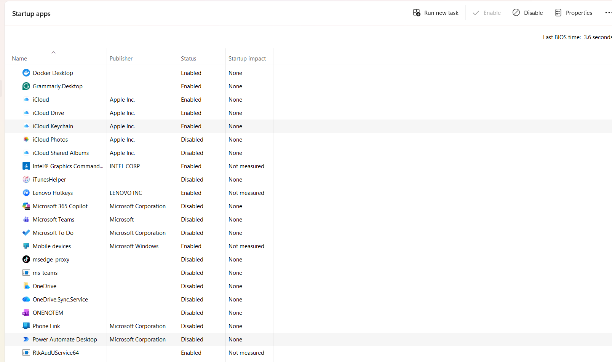
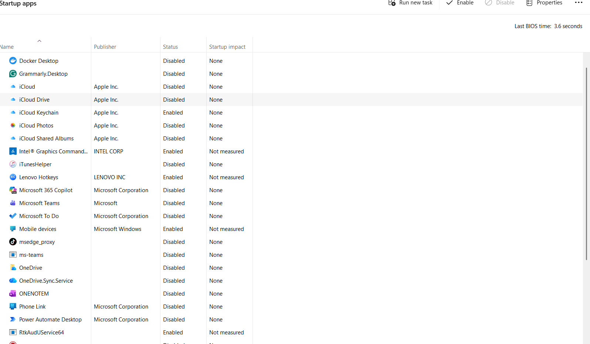

🖥️ Windows Troubleshooting Lab

🔹 Overview

This lab demonstrates my hands-on experience troubleshooting Windows 10/11 system issues including performance problems, BSOD errors, network failures, printer configuration, file sharing, and application crashes.

1️ Slow System Performance (Startup Programs)

 Problem

Computer startup was slow and system performance was degraded.

 Diagnosis

Opened Task Manager → Startup Apps and noticed several programs enabled at startup.

 Screenshot:

 Root Cause

Too many applications launching during startup were consuming system resources and slowing down boot time.

 Action Taken

Disabled unnecessary startup applications using Task Manager.

Steps performed:

Press Ctrl + Shift + Esc

Open Startup Apps

Right-click unnecessary programs

Click Disable

 Screenshot:
 

Result:

Startup performance improved and system boot time was reduced.

2️⃣ System File Integrity Check
4
🛑 Problem

Potential system file corruption affecting system stability.

🔍 Diagnosis

Executed System File Checker to scan Windows system files.

Command used:

sfc /scannow

📸 Screenshot:
Use your screenshot showing SFC scan running (14%).

🎯 Root Cause

Possible corrupted or missing Windows system files.

🛠 Action Taken

Ran:

sfc /scannow

The tool scanned and automatically repaired corrupted system files.

✅ Result

System file integrity verified and repaired where necessary.

3️⃣ Network Configuration Check
4
🛑 Problem

Network device discovery and file sharing issues.

🔍 Diagnosis

Checked Network Profile settings.

Found the network configuration settings.

📸 Screenshot:
Use your screenshot showing Private Network selected.

🎯 Root Cause

Incorrect network profile (Public network can block device discovery).

🛠 Action Taken

Changed network profile to:

Private Network

Steps:

Open Settings

Go to Network & Internet

Select Wi-Fi

Open the connected network

Set Network profile = Private

✅ Result

Network discovery and device communication enabled.

4️⃣ Print Spooler Service Troubleshooting
4
🛑 Problem

Printer services not responding and printing tasks failing.

🔍 Diagnosis

Checked Print Spooler service status.

Command used:

sc query spooler

📸 Screenshot:
Use your screenshot showing:

STATE : STOPPED
🎯 Root Cause

Print Spooler service was stopped, preventing printing operations.

🛠 Action Taken

Restarted the service using Command Prompt.

Commands executed:

net stop spooler
net start spooler
✅ Result

Print Spooler service restarted successfully and printing functionality restored.

5️⃣ System Resource Monitoring
🛑 Problem

Need to monitor CPU and memory utilization.

🔍 Diagnosis

Opened Task Manager → Performance tab to analyze system resource usage.

📸 Screenshot:
Use your screenshot showing CPU performance graph.

🎯 Root Cause

High CPU usage caused by multiple background processes.

🛠 Action Taken

Analyzed running processes and optimized startup applications.

✅ Result

System performance stabilized and CPU usage reduced.
