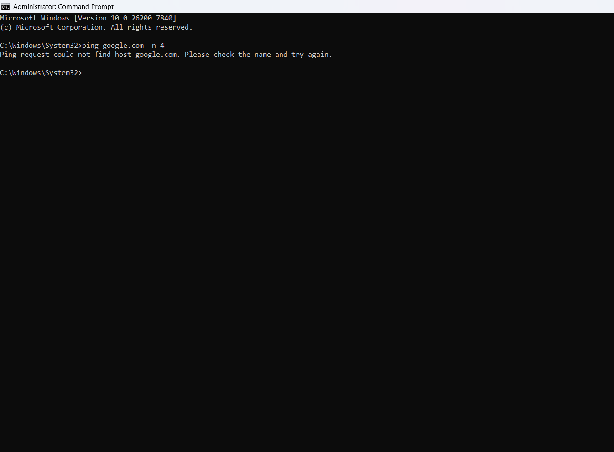
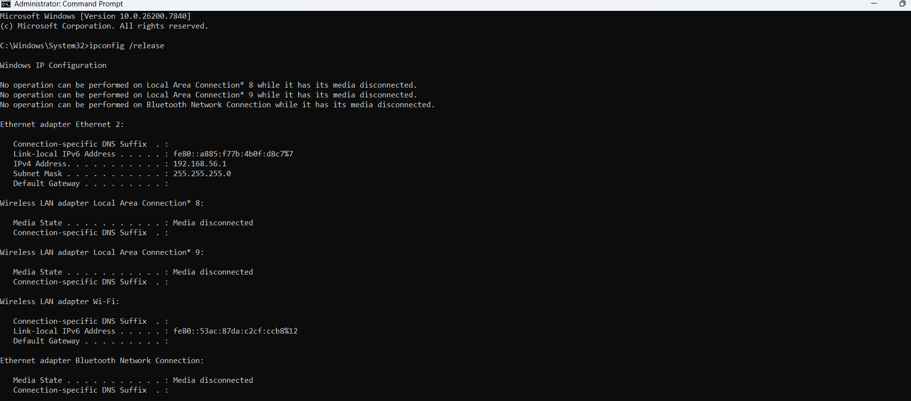
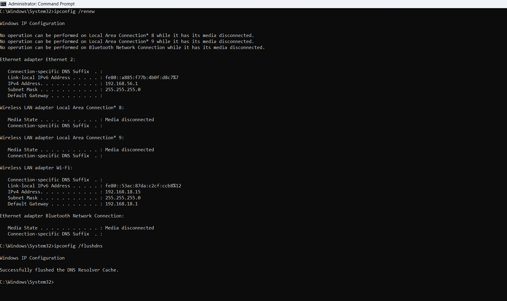
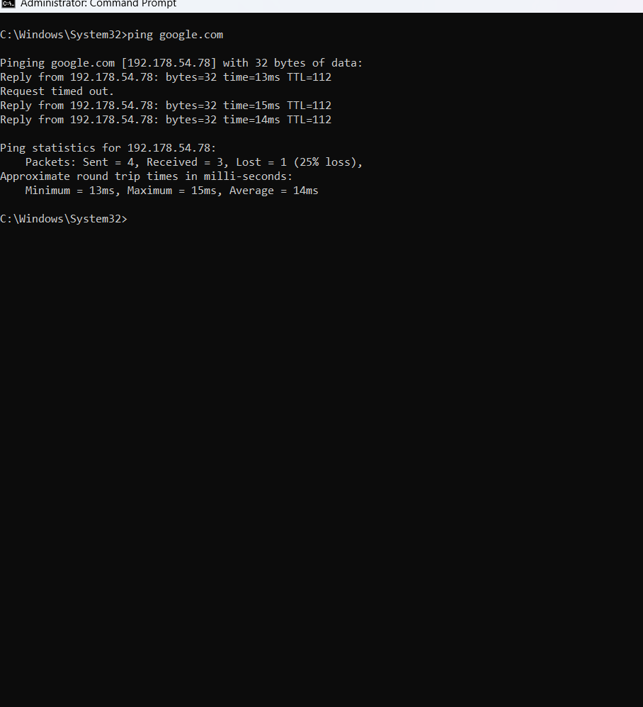
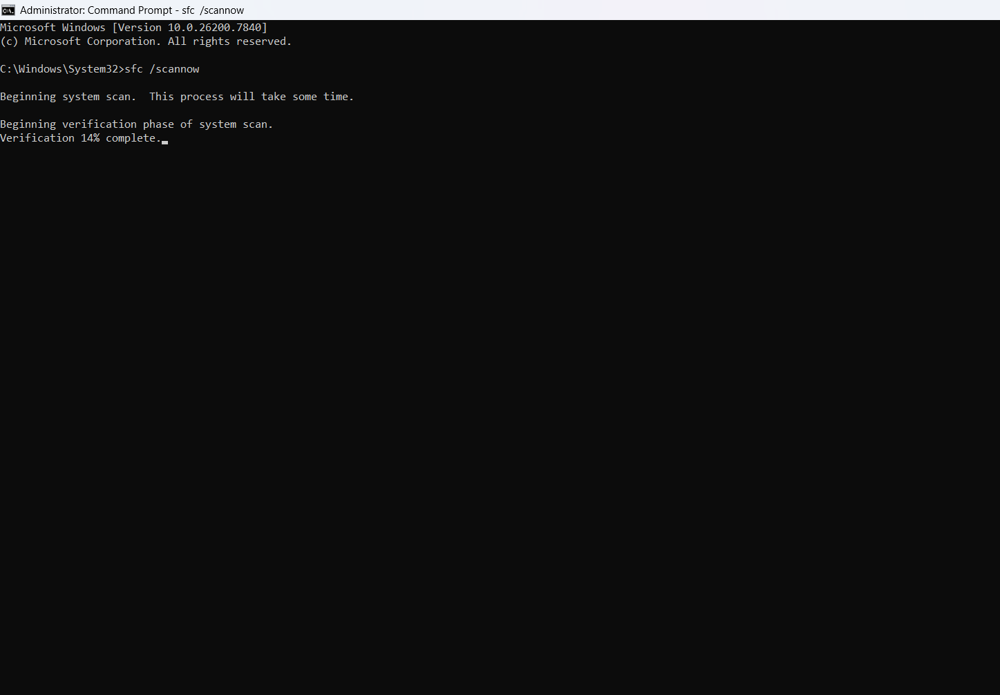
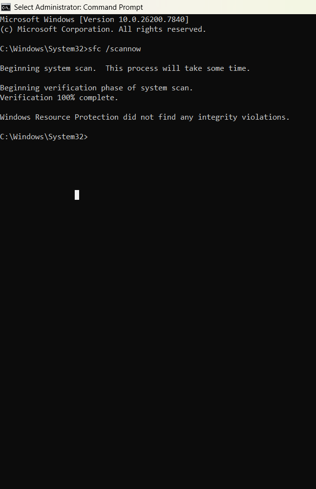
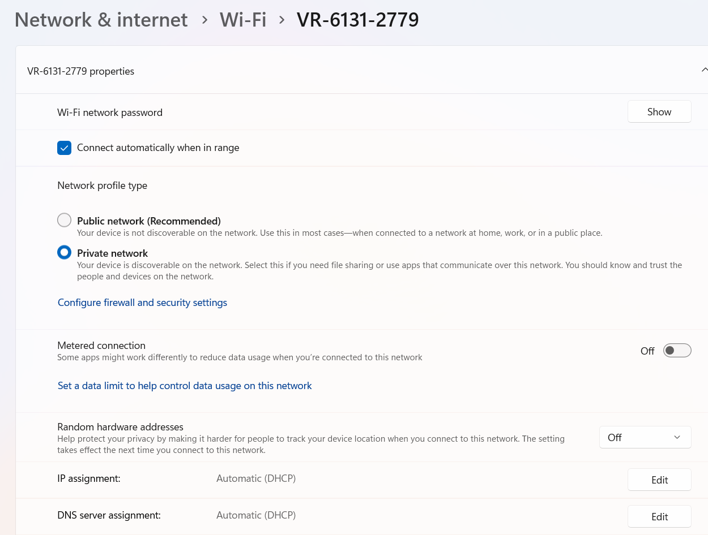
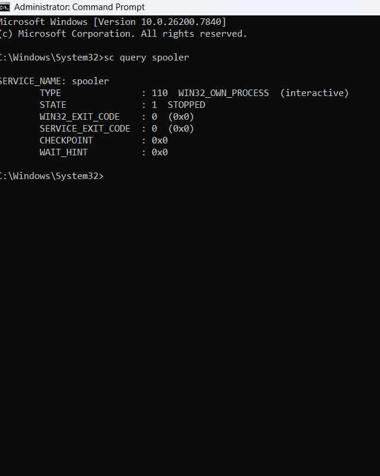
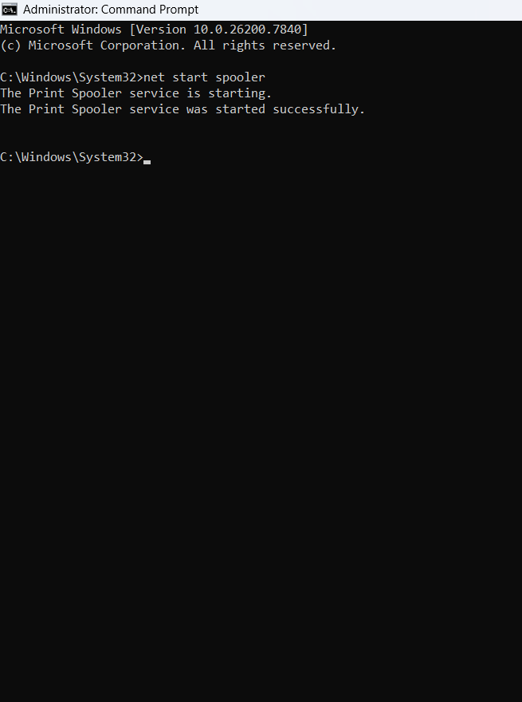
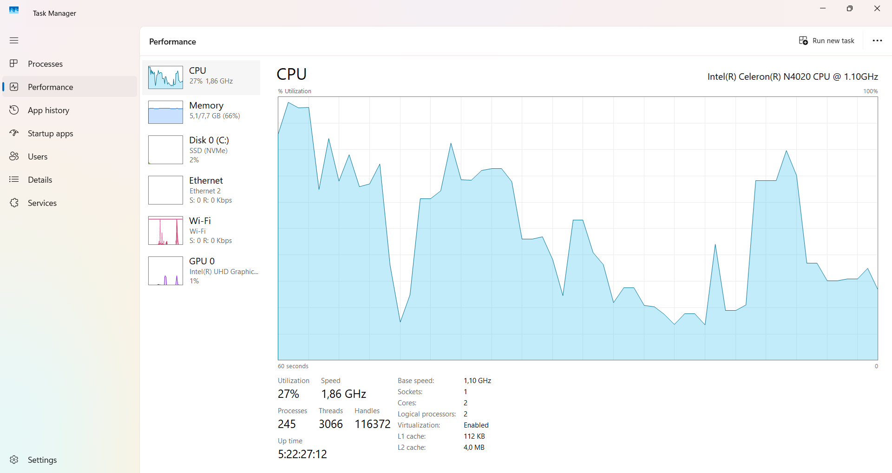

🖥️ Windows Troubleshooting Lab

🔹 Overview

This lab demonstrates my hands-on experience troubleshooting Windows 10/11 system issues including performance problems, BSOD errors, network failures, printer configuration, file sharing, and application crashes.

1.Network Connectivity Troubleshooting

 Problem:

Device could not resolve domain names and failed to reach external servers.

 Diagnosis:

Tested internet connectivity using the ping command.

 Screenshot:
 

(DNS could not resolve google.com)

Command used:

ping google.com -n 4

Result:

Ping request could not find host google.com.

This indicates a DNS resolution issue.

 Troubleshooting Steps
Step 1 — Release Current IP Address

Command:

ipconfig /release

 Screenshot

 

Purpose:

Clears the current IP configuration

Disconnects the device from the network temporarily

Step 2 — Renew IP Address

Command:

ipconfig /renew

Screenshot:

Purpose:

Requests a new IP address from the DHCP server

Step 3 — Flush DNS Cache

Command:

ipconfig /flushdns

 Screenshot :

 

Result:

Successfully flushed the DNS Resolver Cache

Purpose:

Clears corrupted or outdated DNS records

Testing After Fix

 Screenshot 

 

Command:

ping google.com

Result:

Reply from 192.178.xx.xx

Meaning:

DNS resolution works

Internet connectivity restored

2. Slow System Performance (Startup Programs)

 Problem

Computer startup was slow and system performance was degraded.

 Diagnosis

Opened Task Manager → Startup Apps and noticed several programs enabled at startup.

 Screenshot:

 Root Cause

Too many applications launching during startup were consuming system resources and slowing down boot time.

 Action Taken

Disabled unnecessary startup applications using Task Manager.

Steps performed:

Press Ctrl + Shift + Esc

Open Startup Apps

Right-click unnecessary programs

Click Disable

 Screenshot:
 

Result:

Startup performance improved and system boot time was reduced.

3.. System File Integrity Check

 Problem:

Potential system file corruption affecting system stability.

 Diagnosis:

Executed System File Checker to scan Windows system files.

Command used:

sfc /scannow

 Screenshot:

 

Root Cause:

Possible corrupted or missing Windows system files.

Action Taken:

Ran:

sfc /scannow

The tool scanned and automatically repaired corrupted system files.

 Result:
  

This screenshot shows:

Windows Resource Protection did not find any integrity violations.

4.Network Configuration Check

 Problem:

Network device discovery and file sharing issues.

 Diagnosis

Checked Network Profile settings.

Found the network configuration settings.

 Screenshot:

 Root Cause :

Incorrect network profile (Public network can block device discovery).

 Action Taken:

Changed network profile to:

Private Network

Steps:

Open Settings

Go to Network & Internet

Select Wi-Fi

Open the connected network

Set Network profile = Private

 Result

Network discovery and device communication enabled.

5. Print Spooler Service Troubleshooting

 Problem:

Printer services not responding and printing tasks failing.

Diagnosis

Checked Print Spooler service status.

Command used:

sc query spooler

 Screenshot:
 

STATE : STOPPED

 Root Cause:

Print Spooler service was stopped, preventing printing operations.

Action Taken

Restarted the service using Command Prompt.

Commands executed:

net stop spooler
net start spooler

 Result:
 

Print Spooler service restarted successfully and printing functionality restored.

5️ System Resource Monitoring

 Problem:

Need to monitor CPU and memory utilization.

 Diagnosis:

Opened Task Manager → Performance tab to analyze system resource usage.

 Screenshot:

 Root Cause:

High CPU usage caused by multiple background processes.

 Action Taken:

Analyzed running processes and optimized startup applications.

 Result:

System performance stabilized and CPU usage reduced.

